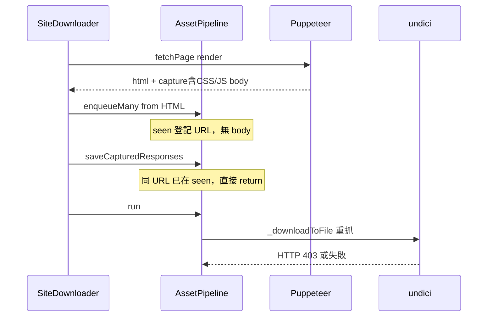

# 修復 render 下載失敗、程式審查與可行性說明

## 1. 為何 `--mode render` 仍 Failed: 3？

你這次的結果（Success: 3、Failed: CSS/JS/banner.png）符合一個**架構層級 bug**，不是 Referer 單一問題。



**根因**（[`SiteDownloader._fetchAndDownloadAssets`](src/downloader/SiteDownloader.js) 第 144–148 行）：

1. 先 `enqueueMany(resources)` — 從 HTML 解析出的 `/assets/index-*.css|js`、`banner.png` **沒有 body**
2. 再 `saveCapturedResponses(capture)` — 瀏覽器已攔截的 **有 body** 的同一 URL 被 [`enqueue()`](src/downloader/AssetPipeline.js) 的 `seen` 擋掉（第 108–109 行）
3. `run()` 只能走 `_downloadToFile`（undici），**沒有瀏覽器 session cookie**，個人站/CDN 常回 **403**

因此 **render 模式目前等於「用瀏覽器拿 HTML，再用一般 HTTP 重下載資源」**，沒有真正用上 network capture。

Success: 3 多半是：少數能靠 Referer 通過的資源、或 capture/undici 其中一條路成功的檔案；**關鍵的 Vite bundle 仍走失敗的 undici 路徑**。

---

## 2. 空資料夾從哪來？

| 原因 | 位置 |
|------|------|
| 下載前就先 `ensureDir` | [`AssetPipeline._downloadOne`](src/downloader/AssetPipeline.js) 第 207 行 |
| 失敗後未刪除空目錄 | `_recordFailure` 無清理 |
| `external/<host>/` 路徑預建 | 跨網域資源映射到 [`PathMapper`](src/downloader/storage/PathMapper.js) `external/` 子目錄，下載失敗則留空 |
| CSS 巢狀 `url()` 再 enqueue | `_processCssFile` 可能新增佇列項目，部分同樣失敗 |

這是**預期副作用**，不是檔案系統 bug，但應在修復後一併改善 UX。

---

## 3. 建議修復（依優先順序）

### P0：讓 render capture 真正生效

**方案 A（建議）— 調整 [`SiteDownloader._fetchAndDownloadAssets`](src/downloader/SiteDownloader.js)：**

```javascript
if (capture) {
    await pipeline.saveCapturedResponses(capture, url, baseDir);
}
const { resources } = extractFromHtml(html, url);
pipeline.enqueueMany(resources, url);
```

**方案 B — 增強 [`AssetPipeline.enqueue`](src/downloader/AssetPipeline.js)：**

- 若 URL 已在 `seen` 且新 meta 含 `body`（長度 > 0），**更新既有 queue item** 的 `body` / `contentType`，不要 return
- 新增 `enqueueOrUpdate(url, pageUrl, meta)` 供 capture 使用

**方案 C — render 模式跳過 undici：**

- 對已有 capture body 的項目禁止 `_downloadToFile`
- 對 render 模式且無 body 的項目，記錄明確錯誤「not captured」

建議 **A + B** 雙保險，並加單元測試。

### P0：瀏覽器 cookie 轉給 fallback HTTP

在 [`BrowserEngine.fetchPage`](src/engine/BrowserEngine.js) 關閉 page 前：

- Puppeteer: `page.cookies()` → 序列化為 `Cookie` header
- 回傳 `{ html, capture, cookies }`，[`SiteDownloader`](src/downloader/SiteDownloader.js) 合併進 `pipelineOptions.cookie`（與使用者 `--cookie` 合併）

這樣即使 capture 漏抓，undici 重試也帶 session。

### P1：空目錄與失敗清理

- 將 `ensureDir` 移到**確定要寫檔**之前（有 body 或 HTTP 200 後）
- 失敗時若目錄為空則 `fs.rmdir`（可選、verbose 時記錄）
- 下載結束後可選掃描並列出空目錄（`-v`）

### P1：undici 雙重解壓風險

[`_downloadToFile`](src/downloader/AssetPipeline.js) 在 `content-encoding` 存在時手動 gunzip/br。undici 可能已自動解壓，導致**損壞檔案**（目前你看到的是 HTTP 錯誤，但值得一併修）。

- 查 undici 行為；若已解壓則不要再 pipe zlib
- 或設 `headers: { 'accept-encoding': 'identity' }` 僅在需要時

### P2：其他審查項（非 henrylok 主因，但應修）

| 項目 | 說明 |
|------|------|
| [`NetworkCapture.shouldCapture`](src/engine/NetworkCapture.js) | `body.length === 0` 仍可能存入空 body，應跳過或標記 |
| Puppeteer `response.buffer()` 失敗 | 大檔/串流常失敗；可改 CDP `Network.getResponseBody` 或只 capture 小於 N MB |
| 無 render 整合測試 | 現有 [`SiteDownloader.integration.test.js`](__tests__/SiteDownloader.integration.test.js) 僅 static fixture |
| npm 版本 | registry 可能仍為 2.0.1；需發布 **2.0.3**（含上述修復）並 OTP 驗證 |
| `hasCriticalFailures` | 僅在 `successCount === 0` 時 fallback；你這次 3 success 不會觸發 auto 重試，合理但可改為「關鍵資源（css/js）失敗即 fallback」 |

---

## 4. 建議新增測試

| 測試檔 | 內容 |
|--------|------|
| `__tests__/AssetPipeline.capture.test.js` | 先 enqueue 無 body，再 enqueue 同 URL 有 body → 最終寫入 capture 內容、不呼叫 undici |
| `__tests__/SiteDownloader.render.test.js` | mock `AnyDownloadEngine.fetchPage` 回傳 capture + html，assert css/js 檔案存在 |
| 手動 | `anydownload example.com --mode render -v` → Success 應含 css+js，Failed 僅 favicon 等可選 |

---

## 5. 「CMD 能否下載所有格式網站」— 可行性評估

**結論：無法做到「網路上所有網站、所有格式、完全離線可用」；對多數公開靜態/SPA 站點是可行且合理的產品目標。**

### 目前架構能做好的

- 公開 HTTP(S) 資源：HTML、CSS、JS、圖片、字型、部分 media
- 同網域或 HTML/CSS 內可解析的 URL
- SPA：修復 capture 後，Vite/React 類站（如 example.com）應可離線開啟

### 本質上做不到或很難的

| 類型 | 原因 |
|------|------|
| 需登入 / paywall | 無憑證或 cookie 不足 |
| DRM 影片（Netflix、Spotify） | 授權與串流加密 |
| 強 bot 防護（Cloudflare challenge） | 需真人或專用 bypass |
| WebSocket / SSE 即時資料 | 非一次性 HTTP 資源 |
| 無限滾動、需點擊才載入 | 需互動腳本或更長等待 |
| 執行期動態 import / WASM 再拉資源 | 需更長 render 或多次爬取 |
| 跨域 CDN 403（無 cookie） | 需 capture 或 cookie 轉發 |
| `blob:` / `data:` URL | 設計上跳過 |

### 建議產品定位（README 可補一段）

> AnyDownload 目標是**可離線瀏覽的網站鏡像**（頁面 + 靜態資源 + 常見 SPA），不是通用「整站爬蟲」或「影片下載器」。

---

## 6. 預期修復後結果

```bash
anydownload example.com --mode render -v
# 預期：assets/index-*.css、index-*.js 成功（來自 capture）
# banner.png 若瀏覽器有載入則成功；否則可標 optional 或延長 --wait
# favicon 失敗可忽略
```

版本：**2.0.3**（修復 capture + cookie + 測試）→ `npm publish`（需 OTP）→ `npm i -g anydownload@latest`

---

## 7. 實作順序

1. 修 `enqueue` / 調整 capture 與 HTML enqueue 順序（P0）
2. 瀏覽器 cookie 轉發（P0）
3. 單元 + mock 整合測試（P0）
4. 空目錄與 undici 解壓（P1）
5. README 可行性說明 + 發布 2.0.3（P2）
